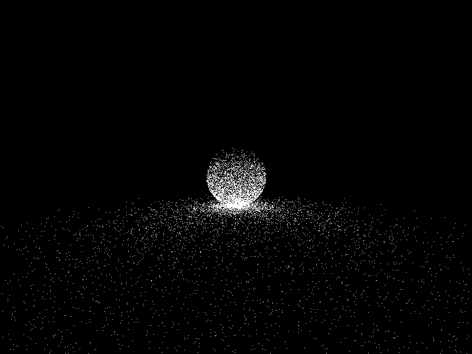

# :maple_leaf: maple

Compute shader path tracer

*Why "maple"? I have no good project names*

## Latest Screenshot

## References
- Morgan McGuire, Computer Graphics Archive, July 2017 (https://casual-effects.com/data)
- Peter Shirley, Ray Tracing in One Weekend, 2018 (https://raytracing.github.io/)
- Alan Wolfe, Casual Shadertoy Path Tracing 1: Basic Camera Diffuse, Emissive, May 2020 (https://blog.demofox.org/2020/05/25/casual-shadertoy-path-tracing-1-basic-camera-diffuse-emissive/)
